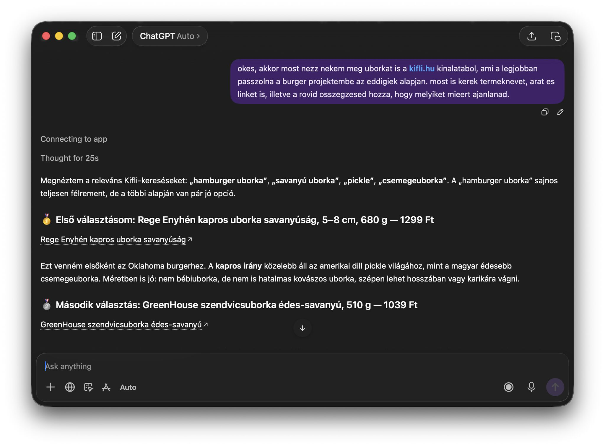
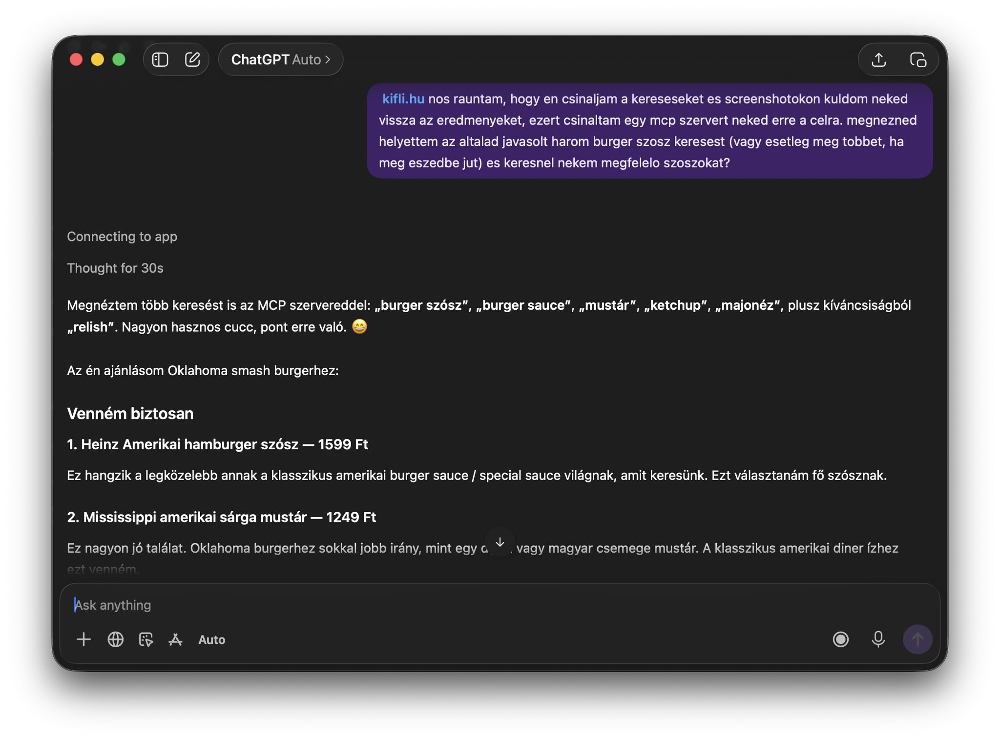

# A tiny birthday side project and a product lesson

A company without a website is almost unimaginable today. A company without a social media presence is increasingly difficult to justify.
I have a feeling that being present in the major AI assistants will become just as essential over the next few years.
I only built this because I happened to be able to solve my own problem. Most people won’t. They’ll simply expect it to work.

This weekend I’m celebrating my birthday with friends and family. As a self-proclaimed “pro home cook”, my plan is to serve the best Oklahoma smash burgers I can realistically make in a home kitchen.
That naturally turned into a rabbit hole of techniques, ingredients, buns, cheese and endless comparisons.

For work I mostly use Claude, but for personal projects I increasingly reach for ChatGPT. The memory feature makes a huge difference when you’re working on something that evolves over days. It already knows my previous experiments, the equipment I have at home, my taste preferences and all the context around the project.
Once the recipe was basically done, I noticed that I wasn’t asking cooking questions anymore.

_I was asking shopping questions._

The conversation already contained everything needed to make good decisions. The only thing missing was access to the products in my grocery webshop.
Since there isn’t an official integration, and current web browsing isn’t particularly good at exploring an entire webshop, I spent a few hours building a tiny MCP server with Codex that lets ChatGPT search products and inspect product pages whenever it needs more context.

_It worked surprisingly well._

No more screenshots. No more manually searching for products. Just continuing the conversation.

## The interesting part

The MCP server itself isn’t the point.
The interesting part is that I felt the need to build it.
As AI assistants become part of more personal, long-running projects, they’ll increasingly become the place where purchasing decisions happen. People won’t want to leave the conversation, search a webshop, compare products, then come back.

**They’ll expect their assistant to do that with them.**

I open-sourced the project, but I’m not publishing it because I have no official association with Kifli.hu, and scraping someone else’s website isn’t the right solution anyway.
The right solution is for retailers to expose these capabilities themselves.

**Sooner rather than later.**

### Technical notes

* Built a small [Node.js](https://nodejs.org/en) MCP server.
* Tried Architecture Decision Records (ADRs) for the first time instead of maintaining one ever-growing AGENTS.md file. I’m quite happy with that decision so far.
* Experimented with [Nub.js](https://nubjs.com), which I can highly recommend checking out.
* Exposed my local MCP server to ChatGPT through Cloudflare Tunnels, which is still amazing to me considering it’s available for free for projects like this.

[Repo](https://github.com/schwarzkopfb/mcpekaru) ⸱ 
[LinkedIn post](https://www.linkedin.com/posts/schwarzkopfb_a-tiny-birthday-side-project-and-a-product-ugcPost-7478500703251050497-mEAd)

